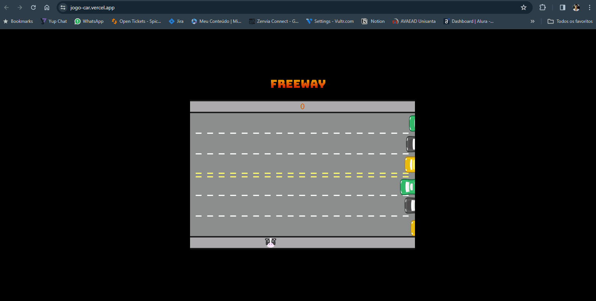

# JogoCar
Esse é um jogo em 2d que foi feito durante o curso de JavaScript da Alura.

O jogo Freeway é um clássico dos videogames, lançado para o console Atari 2600 em 1981. Ele é conhecido por sua simplicidade e desafio crescente, representando um exemplo dos jogos simples e viciantes populares nas primeiras eras dos videogames.

 

## Conceito Básico do Jogo:
### Objetivo:

A tarefa principal dos jogadores é controlar uma galinha que tenta atravessar uma autoestrada movimentada cheia de carros em movimento.
Mecânica do Jogo:

O jogador deve guiar a galinha com habilidade e timing para evitar colisões com os carros em movimento.
O desafio aumenta à medida que a velocidade do tráfego na autoestrada aumenta, exigindo maior destreza do jogador.

